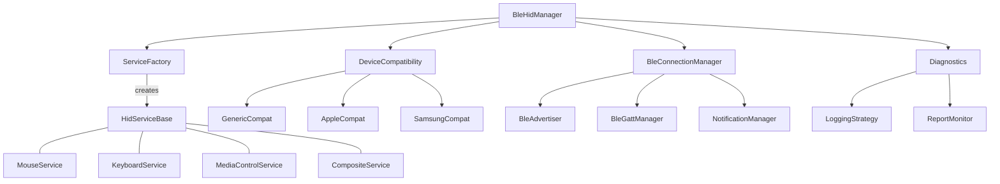

# Architecture Overview

The modernized Inventonater HID architecture follows clean architecture principles with clear separation of concerns and a focus on extensibility.

## Architectural Diagram

## Key Architectural Principles

1. **Interface-First Design**: All components define clear contracts through interfaces before implementation
2. **Separation of Concerns**: Each component has a focused, well-defined responsibility
3. **Dependency Inversion**: Higher-level modules don't depend on lower-level module implementations
4. **Composition Over Inheritance**: Use composition to combine behaviors rather than deep inheritance hierarchies
5. **Strategy Pattern**: Employ strategies for variable behaviors like device compatibility
6. **Factory Pattern**: Use factories to create and manage service instances

## Layer Separation

The architecture is divided into distinct layers:

### API Layer
- Public interfaces exposed to client applications
- Contracts for BLE HID functionality
- Clear abstraction from implementation details

### Service Layer
- HID service implementations (mouse, keyboard, etc.)
- Service factory for creating and combining services
- Common behavior shared across services

### BLE Layer
- Connection management
- GATT server operations
- Advertising and pairing
- Notification handling

### Compatibility Layer
- Device-specific adaptations
- Platform-specific workarounds
- Report map customizations

### Diagnostics Layer
- Logging and monitoring
- Report tracing
- Connection state tracking
- Error handling and reporting

## Core Interactions

1. **Service Registration and Creation**:
   - Services register with the ServiceFactory
   - BleHidManager creates services through the factory
   - Multiple services can be combined for composite devices

2. **Connection Management**:
   - BleConnectionManager handles device connections
   - Notifications route through the NotificationManager
   - Connection state is tracked and published to listeners

3. **Report Processing**:
   - HID services generate reports
   - Reports are sent via the notification system
   - Diagnostics can monitor report generation and delivery

4. **Device Compatibility**:
   - Device detection determines appropriate compatibility strategy
   - Compatibility layer adapts services for specific platforms
   - Custom report maps and characteristics support different hosts
