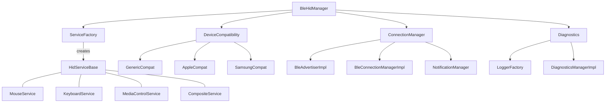

# Architecture Overview

The modernized Inventonater HID architecture follows clean architecture principles with clear separation of concerns and a focus on extensibility. This document reflects the architecture as implemented in the Kotlin-based rewrite.

## Architectural Diagram

## Key Architectural Principles

1. **Interface-First Design**: All components define clear contracts through interfaces before implementation
2. **Separation of Concerns**: Each component has a focused, well-defined responsibility
3. **Dependency Inversion**: Higher-level modules don't depend on lower-level module implementations
4. **Composition Over Inheritance**: Use composition to combine behaviors rather than deep inheritance hierarchies
5. **Strategy Pattern**: Employ strategies for variable behaviors like device compatibility
6. **Factory Pattern**: Use factories to create and manage service instances
7. **Kotlin Coroutines**: Leverage structured concurrency for asynchronous operations

## Layer Separation

The architecture is divided into distinct layers:

### API Layer
- Public interfaces exposed to client applications (`com.inventonater.hid.core.api`)
- Contracts for BLE HID functionality (BleHidManager, ServiceFactory, etc.)
- Clear abstraction from implementation details
- Kotlin-friendly API with nullability annotations

### Service Layer
- HID service implementations (MouseService, KeyboardService, etc.)
- Service factory for creating and combining services (ServiceFactoryImpl)
- Common behavior shared across services (AbstractHidService)
- HID report generation and management

### BLE Layer
- Connection management (BleConnectionManagerImpl)
- GATT server operations
- Advertising and pairing (BleAdvertiserImpl)
- Notification handling
- Coroutine-based asynchronous operations

### Compatibility Layer
- Device-specific adaptations (CompatibilityStrategies)
- Platform-specific workarounds
- Report map customizations
- Sealed classes for different compatibility types

### Diagnostics Layer
- Logging and monitoring (LoggerFactory)
- Report tracing
- Connection state tracking
- Error handling and reporting
- LogLevel enum for controlled verbosity

## Core Interactions

1. **Service Registration and Creation**:
   - Services register with the ServiceFactory
   - BleHidManager creates services through the factory
   - Multiple services can be combined for composite devices

2. **Connection Management**:
   - ConnectionManager handles device connections
   - Notifications route through the NotificationManager
   - Connection state is tracked and published to listeners
   - Coroutines manage asynchronous connection operations

3. **Report Processing**:
   - HID services generate reports
   - Reports are sent via the notification system
   - Diagnostics monitor report generation and delivery
   - Structured data classes represent report information

4. **Device Compatibility**:
   - Device detection determines appropriate compatibility strategy
   - Compatibility layer adapts services for specific platforms
   - Custom report maps and characteristics support different hosts

## Major Improvements in Kotlin Implementation

1. **Null Safety**:
   - All API interfaces properly annotated for nullability
   - Eliminate null-related crashes through compiler enforcement

2. **Concurrency Model**:
   - Coroutines replace callback-based asynchronous code
   - Structured concurrency with proper scope management
   - Suspension functions for potentially blocking operations

3. **Type Safety**:
   - Sealed classes for state representation
   - Enums for controlled values (LogLevel, MouseButton)
   - Extension functions for type-safe operations

4. **API Clarity**:
   - Clear separation between public API and internal implementation
   - Immutable data models where appropriate
   - Function parameters use named arguments for readability

5. **Resource Management**:
   - Proper lifecycle management and resource cleanup
   - Coroutine scopes aligned with component lifecycles
   - Clear ownership of resource allocation and deallocation
