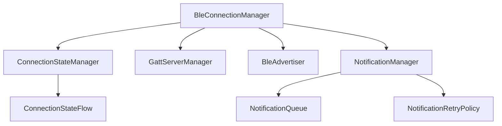

# BLE Connectivity Management

This document outlines our approach to improve the BLE connectivity components, enhance reliability, and simplify development.

## Current Challenges

From analyzing the existing codebase, we've identified several areas for improvement:

1. **Connection State Management**: Inconsistent tracking of connection states
2. **Notification Handling**: Ad-hoc notification delivery without proper verification
3. **Error Recovery**: Limited retry and reconnection capabilities
4. **Thread Management**: Use of direct Thread.sleep() calls for timing
5. **Callback Organization**: Nested callbacks creating maintenance challenges

## Improved Architecture



## Key Components

### ConnectionStateManager

Responsible for tracking and broadcasting connection state changes:

- Uses a state machine approach with clearly defined states
- Publishes state changes using StateFlow
- Provides safe state transition handling
- Automatically attempts recovery when appropriate

### GattServerManager

Handles GATT server setup and operations:

- Centralizes characteristic and descriptor registration
- Provides type-safe access to GATT operations
- Maintains service and characteristic registration state
- Handles read/write requests with proper error handling

### NotificationManager

Manages notification delivery to connected devices:

- Queues notifications when appropriate
- Implements configurable retry policies
- Tracks notification confirmation
- Provides statistics and diagnostics

### BleAdvertiser

Controls BLE advertising with enhanced feature set:

- Configurable advertising parameters
- Rotation of advertising data if needed
- Automatic restart when disconnected
- Adaptive advertising for different scenarios

## Improved Reliability Mechanisms

### Connection Recovery

1. **Automatic Reconnection**: Attempt to reconnect when unexpectedly disconnected
2. **Backoff Strategy**: Implement exponential backoff for reconnection attempts
3. **Connection Monitoring**: Detect and recover from "half-open" connections
4. **State Restoration**: Restore device state after reconnection

### Notification Reliability

1. **Notification Acknowledgment**: Track if notifications are delivered
2. **Notification Queuing**: Queue notifications during connection issues
3. **Prioritized Delivery**: Allow critical notifications to bypass the queue
4. **Rate Limiting**: Prevent overwhelming the BLE stack

### Error Handling

1. **Categorized Errors**: Group errors by type and recovery strategy
2. **Result Type**: Use Kotlin's Result for operation outcomes
3. **Consistent Error Propagation**: Standard error reporting across components
4. **Detailed Logging**: Comprehensive logging of errors and recovery attempts

## Asynchronous Operation

Move from callbacks to coroutines and flows:

```kotlin
// Example coroutine-based operations
suspend fun connect(device: BluetoothDevice): Result<Unit>
suspend fun disconnect(): Result<Unit>
suspend fun sendNotification(characteristic: UUID, data: ByteArray): Result<Unit>

// State observation
val connectionState: StateFlow<ConnectionState>
val gattOperations: Flow<GattOperation>
```

## Connection State Machine

```
+----------------+   connect()   +------------+   success    +------------+
| Disconnected   | ------------> | Connecting | -----------> | Connected  |
+----------------+               +------------+              +------------+
        ^                              |                           |
        |                              |                           |
        |          failure             |                           |
        +------------------------------+                           |
        |                                                          |
        |                disconnect()                              |
        +----------------------------------------------------------+
```

### Connection States

- **Disconnected**: No device connection is active
- **Connecting**: Connection attempt in progress
- **Connected**: Connection established and ready
- **Disconnecting**: Disconnection in progress
- **Failed**: Connection attempt failed with reason

## Advertising Management

Improved advertising with multiple modes:

1. **Standard Advertising**: Normal BLE HID advertising
2. **Fast Advertising**: Higher frequency for quick discovery
3. **Low Power Advertising**: Extended intervals for battery saving
4. **Enhanced Advertising**: Using extended advertising when available

## Implementation Approach

1. Create a proper state machine for connection management
2. Implement coroutine-based operations for asynchronous tasks
3. Develop proper notification queue and retry system
4. Create clear separation between state management and operations
5. Add comprehensive logging and monitoring

## Testing Strategy

1. **Unit Tests**: Verify state transitions and operation logic
2. **Integration Tests**: Test across component boundaries 
3. **Mock BLE Stack**: Create mock BLE components for testing
4. **Scenario Testing**: Test specific failure and recovery scenarios

## Benefits

1. **Reliability**: More robust connection handling and recovery
2. **Simplicity**: Cleaner, more maintainable code
3. **Observability**: Better visibility into connection state and issues
4. **Flexibility**: Easier to adapt to different devices and scenarios
5. **Performance**: More efficient handling of BLE operations
