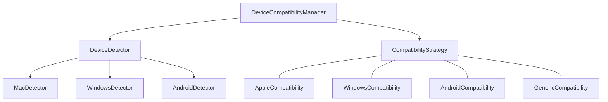

# Device Compatibility Strategy

This document outlines our approach to handling device-specific compatibility issues for different BLE HID host platforms.

## Current Challenges

In the existing implementation, device compatibility is handled primarily through the `AppleHidCompatibility` class, which contains specific workarounds for Apple devices. This approach has several limitations:

1. **Limited Extensibility**: Adding support for new platforms requires modifying existing code
2. **Direct Implementation Dependencies**: Hard-coded references to specific compatibility implementations
3. **Lack of Abstraction**: No clear separation between core functionality and platform-specific adaptations
4. **Limited Device Detection**: Basic approach to identifying host device types

## Improved Strategy Pattern Approach



## Key Components

### DeviceCompatibilityManager

Central component that coordinates compatibility strategies:

- Detects the connected host device type
- Selects and applies the appropriate compatibility strategy
- Provides a unified interface for compatibility operations
- Manages device-specific configuration

### CompatibilityStrategy Interface

Defines the contract for platform-specific compatibility implementations:

- Standard methods for adapting HID services
- Customizing report descriptors
- Setting device-specific properties
- Handling platform-specific quirks

### Platform-Specific Implementations

Each supported platform has its own implementation of CompatibilityStrategy:

#### AppleCompatibility

- Customized report maps for better macOS/iOS compatibility
- Special HID descriptor configurations
- Notification handling adaptations
- Apple-specific naming conventions

#### WindowsCompatibility

- Windows-specific report descriptors
- Handling Windows connection quirks
- Appropriate device naming for Windows
- Special characteristic configurations

#### AndroidCompatibility

- Android-specific report handling
- Configurations for Android host devices
- Appropriate service and characteristic settings

#### GenericCompatibility

- Default compatibility implementation for unknown platforms
- Most standards-compliant approach
- Fallback options for unsupported devices

### Device Detection

Enhanced device detection using multiple signals:

- Device name pattern matching
- Service discovery characteristics
- Connection behavior patterns
- Explicit configuration options

## Implementation Approach

### Dependency Injection

Compatibility strategies are provided through dependency injection:

```kotlin
class BleHidManagerImpl(
    private val compatibilityManager: DeviceCompatibilityManager,
    // other dependencies
) : BleHidManager {
    // Implementation using the compatibility manager
}
```

### Strategy Selection

Dynamic strategy selection based on connected device:

```kotlin
class DeviceCompatibilityManagerImpl(
    private val strategies: Map<DeviceType, CompatibilityStrategy>,
    private val detector: DeviceDetector,
    private val defaultStrategy: CompatibilityStrategy
) : DeviceCompatibilityManager {
    
    fun getStrategyForDevice(device: BluetoothDevice): CompatibilityStrategy {
        val deviceType = detector.detectDeviceType(device)
        return strategies[deviceType] ?: defaultStrategy
    }
}
```

### Service Adaptation

Services are adapted for specific platforms:

```kotlin
interface CompatibilityStrategy {
    fun adaptReportMap(reportMap: ByteArray): ByteArray
    fun adaptHidInformation(): ByteArray
    fun getDeviceName(): String
    fun configureService(service: BluetoothGattService)
    fun handleCharacteristicRead(characteristic: BluetoothGattCharacteristic)
}
```

## Configuration System

Device compatibility can be configured:

1. **Automatic Detection**: System automatically detects connected device type
2. **Manual Override**: User can manually specify device type
3. **Custom Configuration**: Advanced settings for specific devices
4. **Fallback Options**: Default behavior for unrecognized devices

## Example: Report Map Adaptation

Apple devices require specific report map modifications:

```kotlin
class AppleCompatibilityStrategy : CompatibilityStrategy {
    override fun adaptReportMap(reportMap: ByteArray): ByteArray {
        // Modify the report map for better Apple compatibility
        // Example: Change report flags, adjust descriptor formats, etc.
        return modifiedReportMap
    }
}
```

## Testing Approach

1. **Platform-Specific Tests**: Tests for each supported platform
2. **Detection Logic Tests**: Verify accurate device type detection
3. **Strategy Selection Tests**: Ensure correct strategy is selected
4. **Service Adaptation Tests**: Validate that services are properly adapted

## Extending the System

Adding support for new device types:

1. Implement a new `CompatibilityStrategy` for the platform
2. Add device detection logic
3. Register the new strategy with the `DeviceCompatibilityManager`
4. Add any necessary platform-specific tests

## Benefits

1. **Clear Separation**: Platform-specific code is separate from core functionality
2. **Easy Extension**: Adding new platforms doesn't require modifying existing code
3. **Improved Testing**: Platform-specific behavior can be tested independently
4. **Better Configurability**: Users can control compatibility behavior
5. **Enhanced Device Support**: More robust handling of different platforms
