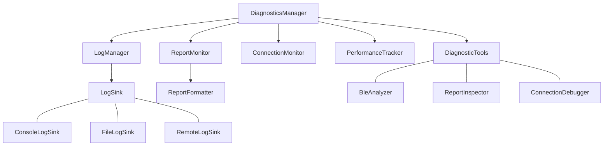

# Diagnostics and Logging

This document outlines our approach to enhancing the diagnostics and logging capabilities in the Inventonater HID system.

## Importance of Diagnostics

BLE HID systems involve complex interactions between devices that can be challenging to debug. Strong diagnostics are crucial for:

1. **Troubleshooting Connection Issues**: Identifying why devices won't connect or stay connected
2. **Understanding Report Delivery**: Verifying if HID reports are being sent correctly
3. **Compatibility Problems**: Diagnosing platform-specific issues
4. **Performance Analysis**: Identifying bottlenecks and inefficiencies
5. **User Support**: Enabling end users to provide useful diagnostic information

## Current Limitations

The existing system has basic logging but several limitations:

1. **Inconsistent Logging**: No standard approach to logging across components
2. **Limited Verbosity Control**: Difficult to adjust detail level for diagnostics
3. **No Built-in Monitoring**: No way to monitor HID reports in real-time
4. **Minimal Error Context**: Error logs often lack useful context
5. **No Command Line Tools**: Limited diagnostics through debugging shell scripts

## Diagnostic Architecture



## Key Components

### LogManager

Provides a structured, multi-level logging system:

- Multiple verbosity levels (ERROR, WARN, INFO, DEBUG, VERBOSE)
- Tagged logging for component-specific filtering
- Contextual logging with metadata
- Configurable log destinations (console, file, remote)

### ReportMonitor

Captures and analyzes HID reports:

- Records all HID reports sent and received
- Provides visualizations of report data
- Tracks report delivery success/failure
- Measures timing between reports
- Identifies patterns and anomalies

### ConnectionMonitor

Tracks connection-related events:

- Records connection state transitions
- Measures connection establishment time
- Tracks disconnection reasons
- Monitors GATT operations
- Records pairing and bonding details

### PerformanceTracker

Monitors system performance:

- Measures operation latency
- Tracks resource utilization
- Identifies potential bottlenecks
- Records timing statistics
- Provides performance recommendations

### DiagnosticTools

Provides active diagnostic tools:

- BLE signal strength analysis
- Device compatibility checking
- Report validation tools
- Connection troubleshooting wizards
- Self-test capabilities

## Implementation Details

### Structured Logging API

```kotlin
interface LogManager {
    fun log(
        level: LogLevel,
        tag: String,
        message: String,
        throwable: Throwable? = null,
        metadata: Map<String, Any>? = null
    )
    
    fun getLogger(tag: String): Logger
    fun setLogLevel(level: LogLevel)
    fun addLogSink(sink: LogSink)
    fun removeLogSink(sink: LogSink)
}

interface Logger {
    fun error(message: String, throwable: Throwable? = null, metadata: Map<String, Any>? = null)
    fun warn(message: String, throwable: Throwable? = null, metadata: Map<String, Any>? = null)
    fun info(message: String, metadata: Map<String, Any>? = null)
    fun debug(message: String, metadata: Map<String, Any>? = null)
    fun verbose(message: String, metadata: Map<String, Any>? = null)
}
```

### Report Monitoring API

```kotlin
interface ReportMonitor {
    fun trackReport(
        reportType: ReportType,
        reportId: Int,
        data: ByteArray,
        direction: ReportDirection
    )
    
    fun getReportHistory(
        reportType: ReportType? = null,
        timeRange: TimeRange? = null
    ): List<ReportRecord>
    
    fun subscribeToReports(listener: ReportListener)
    fun unsubscribeFromReports(listener: ReportListener)
}
```

### Connection Monitoring API

```kotlin
interface ConnectionMonitor {
    fun trackConnectionState(device: BluetoothDevice, state: ConnectionState)
    fun trackGattOperation(operation: GattOperation)
    fun getConnectionHistory(device: BluetoothDevice? = null): List<ConnectionEvent>
    fun subscribeToConnectionEvents(listener: ConnectionEventListener)
    fun unsubscribeFromConnectionEvents(listener: ConnectionEventListener)
}
```

## Diagnostic UI Improvements

1. **Real-time Report Visualization**: Visual display of HID reports
2. **Connection State Dashboard**: Current and historical connection states
3. **BLE Signal Strength Meter**: Visual indicator of connection quality
4. **Error Categorization UI**: Group and filter errors by type
5. **Compatibility Status Indicators**: Show platform-specific compatibility status

## Command-Line Diagnostic Tools

Enhance the existing ble-tools.sh script with:

1. **Report Testing**: Send test reports to verify HID functionality
2. **Connection Testing**: Test connection establishment and reliability
3. **Compatibility Checking**: Verify compatibility with different platforms
4. **Performance Benchmarking**: Measure system performance
5. **Log Analysis**: Parse and analyze log files

## Remote Diagnostics

For supporting users in the field:

1. **Diagnostic Sessions**: Create shareable diagnostic recordings
2. **Log Export**: Export logs in structured formats
3. **Remote Monitoring**: Optional remote diagnostics with user consent
4. **Diagnostic Reports**: Generate comprehensive diagnostic reports
5. **Issue Reproduction**: Tools to reliably reproduce issues

## Integration with Development Tools

1. **IDE Integration**: Logging extensions for Android Studio
2. **Custom Log Viewers**: Specialized tools for HID log analysis
3. **Testing Framework**: Diagnostics integrated with testing
4. **CI/CD Support**: Diagnostic validation in continuous integration

## Benefits

1. **Faster Debugging**: Quickly identify and resolve issues
2. **Better User Support**: Help users troubleshoot their own problems
3. **Quality Assurance**: Catch issues before they affect users
4. **Development Efficiency**: Reduce time spent on troubleshooting
5. **Platform Adaptation**: Identify platform-specific issues faster
