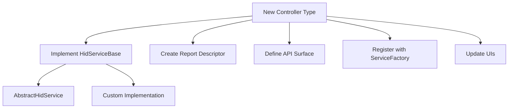

# Adding New Controller Types

This document provides a guide for extending the Inventonater HID system with new controller types beyond the basic mouse and keyboard.

## Controller Type Overview

The Inventonater HID system is designed to support various HID device types through a flexible service architecture. Common HID controller types include:

1. **Mouse**: Standard pointing device with buttons and scrolling
2. **Keyboard**: Basic keyboard with standard keys
3. **Media Controller**: Media keys such as play/pause, volume, etc.
4. **Gamepad**: Game controller with buttons, triggers, and joysticks
5. **Touchpad**: Multi-touch input surface
6. **Combined Devices**: Multiple controller types in a single device

## Extension Points

The system provides several ways to add new controller types:



## Step-by-Step Implementation Guide

### 1. Define the Report Descriptor

Every HID device needs a report descriptor defining its capabilities:

- Determine the required input, output, and feature reports
- Define the report format (buttons, axes, etc.)
- Assign report IDs, ensuring no conflicts with existing services
- Create the byte array representation of the report descriptor

Example: Media Controller Report Descriptor structure:

```
Usage Page (Consumer)
Usage (Consumer Control)
Collection (Application)
  Report ID (3)  // Choose a unique ID
  Usage (Play/Pause)
  Usage (Next Track)
  Usage (Previous Track)
  Usage (Volume Up)
  Usage (Volume Down)
  Usage (Mute)
  Logical Minimum (0)
  Logical Maximum (1)
  Report Size (1)
  Report Count (6)
  Input (Data, Variable, Absolute)
  Report Size (2)
  Report Count (1)
  Input (Constant)  // Padding
End Collection
```

### 2. Implement the Service Class

Create a new service class implementing the HID functionality:

1. Extend `AbstractHidService` or implement `HidServiceBase` directly
2. Implement the required methods
3. Create the report generation logic
4. Handle any special requirements for the device type

Example service skeleton:

```kotlin
class MediaControlService(
    private val notificationManager: NotificationManager,
    private val diagnosticsManager: DiagnosticsManager
) : AbstractHidService(SERVICE_ID, notificationManager, diagnosticsManager) {

    companion object {
        const val SERVICE_ID = "media_control"
        private const val REPORT_ID = 0x03
        // Other constants
    }
    
    override val reportMap: ByteArray = MEDIA_CONTROL_REPORT_MAP
    
    // Implement methods for media control operations
    fun playPause(): Boolean {
        // Generate and send report
    }
    
    fun volumeUp(): Boolean {
        // Generate and send report
    }
    
    // Other media control methods
}
```

### 3. Register with the Service Factory

Register the new service type with the ServiceFactory:

```kotlin
// In your initialization code
serviceFactory.register(MediaControlService.SERVICE_ID) { 
    MediaControlService(notificationManager, diagnosticsManager)
}
```

### 4. Create Public API Surface

Add methods to the BleHidManager interface to expose the new functionality:

```kotlin
interface BleHidManager {
    // Existing methods
    
    // New media control methods
    fun playPause(): Boolean
    fun volumeUp(): Boolean
    fun volumeDown(): Boolean
    fun nextTrack(): Boolean
    fun previousTrack(): Boolean
    fun mute(): Boolean
}
```

### 5. Implement API in BleHidManager

Implement the new methods in the BleHidManager implementation:

```kotlin
class BleHidManagerImpl(
    // Dependencies
) : BleHidManager {
    // Existing implementation
    
    override fun playPause(): Boolean {
        return withService<MediaControlService> { service ->
            service.playPause()
        } ?: false
    }
    
    // Other media control implementations
    
    // Helper method to get and use a specific service
    private inline fun <reified T : HidServiceBase> withService(block: (T) -> Boolean): Boolean? {
        val service = serviceManager.getService(T::class.java)
        return service?.let { block(it as T) }
    }
}
```

### 6. Add UI Support

Create a UI for controlling the new device type:

1. Design an appropriate UI for the controller
2. Implement the activity or fragment
3. Connect UI actions to the BleHidManager API
4. Add appropriate feedback and diagnostics

### 7. Add Device Compatibility Support

Ensure the new controller works with various host platforms:

1. Implement any necessary compatibility adjustments
2. Test with different host operating systems
3. Document any platform-specific considerations

## Example: Adding a Media Controller

### Report Descriptor

The media controller would use the Consumer Control page for media keys:

```kotlin
private val MEDIA_CONTROL_REPORT_MAP = byteArrayOf(
    // Usage Page (Consumer)
    0x05, 0x0C,
    // Usage (Consumer Control)
    0x09, 0x01,
    // Collection (Application)
    0xA1, 0x01,
    // Report ID (3)
    0x85, 0x03,
    // Usage (Play/Pause)
    0x09, 0xCD,
    // Usage (Next Track)
    0x09, 0xB5,
    // Usage (Previous Track)
    0x09, 0xB6,
    // Usage (Volume Up)
    0x09, 0xE9,
    // Usage (Volume Down)
    0x09, 0xEA,
    // Usage (Mute)
    0x09, 0xE2,
    // Logical Minimum (0)
    0x15, 0x00,
    // Logical Maximum (1)
    0x25, 0x01,
    // Report Size (1)
    0x75, 0x01,
    // Report Count (6)
    0x95, 0x06,
    // Input (Data, Variable, Absolute)
    0x81, 0x02,
    // Report Size (2)
    0x75, 0x02,
    // Report Count (1)
    0x95, 0x01,
    // Input (Constant)
    0x81, 0x01,
    // End Collection
    0xC0
)
```

### Report Structure

A simple media control report would have this structure:

```
[Report ID] [Button Bits] [Padding]
   0x03      PPNVMU00      00
```

Where:
- P = Play/Pause
- N = Next Track
- V = Previous Track
- M = Volume Up
- U = Volume Down
- M = Mute
- 0 = Unused bit

### Media Control API

The public API would offer straightforward media control:

```kotlin
fun playPause(): Boolean
fun nextTrack(): Boolean
fun previousTrack(): Boolean
fun volumeUp(): Boolean
fun volumeDown(): Boolean
fun mute(): Boolean
```

## Composite Controllers

For more complex devices combining multiple functions:

1. Create individual service implementations for each function
2. Use the CompositeHidService to combine them
3. Ensure report IDs don't conflict
4. Create a combined report descriptor

Example of creating a composite service:

```kotlin
// Creating a keyboard with media controls
val keyboardService = serviceFactory.create(KeyboardService.SERVICE_ID)
val mediaService = serviceFactory.create(MediaControlService.SERVICE_ID)

val compositeService = CompositeHidService(
    "keyboard_with_media",
    listOf(keyboardService, mediaService),
    notificationManager,
    diagnosticsManager
)
```

## Testing New Controller Types

1. **Report Validation**: Ensure reports follow the HID specification
2. **Platform Testing**: Test with various operating systems
3. **Usability Testing**: Validate the controller from a user perspective
4. **Performance Testing**: Check for any performance impacts
5. **Compatibility Testing**: Verify compatibility with existing services

## Documentation Requirements

When adding a new controller type, provide:

1. **Report Descriptor Documentation**: Document the report format
2. **API Documentation**: Document the public API
3. **Platform Compatibility Notes**: Note any platform-specific considerations
4. **Usage Examples**: Provide examples of how to use the new controller
5. **UI Guidelines**: If applicable, provide UI design guidelines
